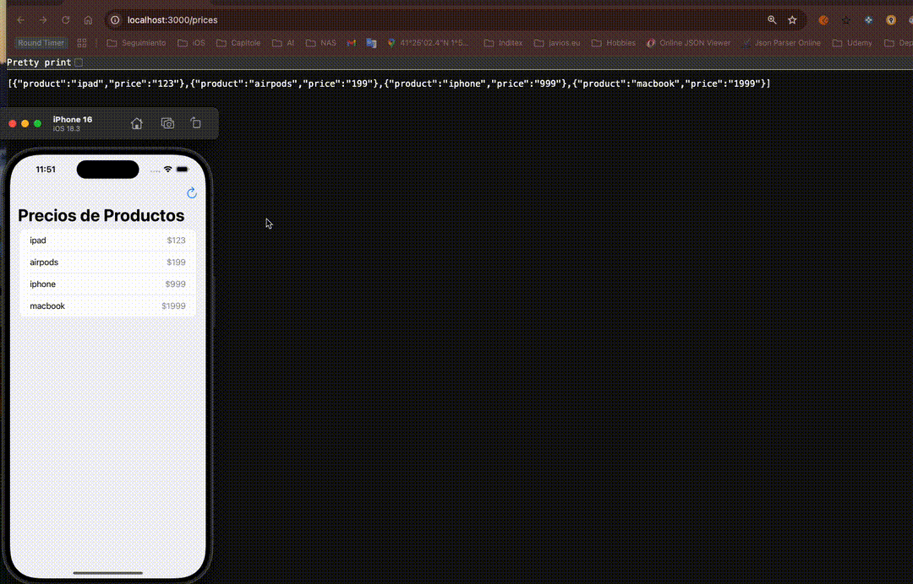

# Redis iOS App
This repository contains a client-server application. Server are two dockerized containers, first container is a Node.js server works as a middleware betwen client and Redis server and second container is a pure image of Redis server. Client is a sample iOS App that fetches a list of product-prices and also is able to update the product-price.

 This is the base code used in following posts [Enhancing iOS Apps with Redis](https://javios.eu/swift/enhancing-ios-apps-with-redis/)

## 🎥 Demo Video

### Check out the app in action!  

## Requirements

- **Xcode 15.0 or later**
- **iOS 16.0 or later**
- **Swift 6.0**

